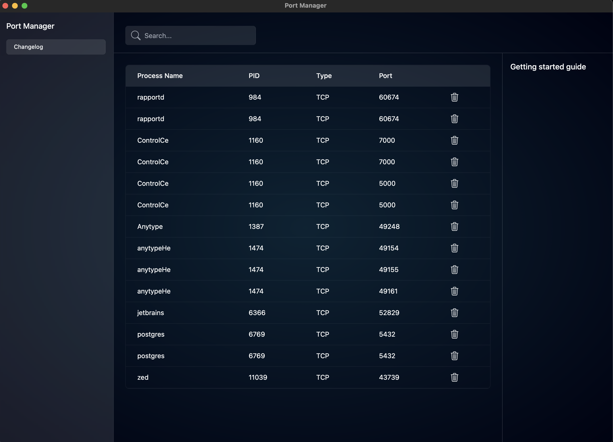

# Port Manager
A cross-platofrm desktop app to manage your ports made with [Dioxus](https://dioxuslabs.com/) and `Rust`.



> This app has been tested only on `macOS`. Test on other platform will be done later.

## Setup

```sh
git clone repo
cd repo
dx serve --hot-reload --platform desktop
# alternatively, you could run
cargo run
```